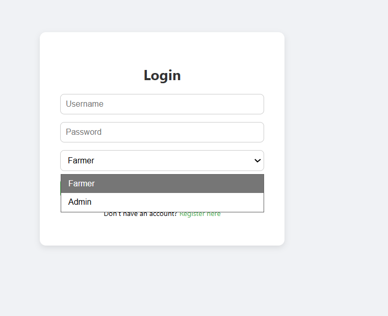
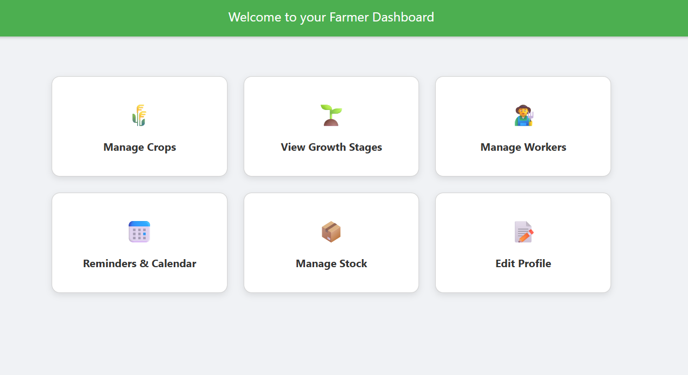

# Farmventory – Farmer Inventory Management System

## Overview

In today’s digital age, managing agricultural operations through manual and paper-based methods often leads to inefficiency, data loss, and poor resource planning. **Farmventory** is a modern, web-based platform developed to digitize and simplify the management of farming operations.

The system provides farmers with a centralized interface to manage crops, monitor growth stages, track stock levels, assign and manage workers, and receive reminders for critical farming activities. All data is stored securely and can be accessed anytime, ensuring accuracy, reliability, and ease of use.

---

## Objectives of the System

* Allow farmers to maintain and manage personal details such as name, contact information, and login credentials
* Enable digital management of crop records and growth stages
* Help farmers manage farming stock such as seeds, fertilizers, and pesticides
* Record and organize worker details, roles, and assignments
* Provide reminders and alerts for timely agricultural activities
* Replace manual recordkeeping with a reliable digital solution

---

## Functional Scope

* **User Registration and Login**
  Secure account creation and authentication for farmers

* **Farmer Profile Management**
  Add, update, and delete personal farmer details

* **Crops Management**
  Maintain a digital list of cultivated crops with relevant information

* **Growth Stages Tracking**
  Record and monitor different stages of crop growth

* **Worker Management**
  Add and manage worker details, roles, and assigned tasks

* **Stock Inventory Management**
  Track stock levels of seeds, fertilizers, pesticides, and other inputs

* **Reminders and Alerts**
  Notifications for sowing, irrigation, fertilization, harvesting, and low-stock situations

---

## Technologies Used

### Backend

* **Node.js**
  An open-source JavaScript runtime environment used for server-side development

* **Express.js**
  A Node.js web framework used for routing, handling HTTP requests, and API development

### Database

* **MySQL**
  Relational Database Management System used to store farmer details, crops, stock, workers, and growth stage data

### Frontend

* **HTML**
  Used to structure web pages and forms

* **CSS (Bootstrap 5)**
  Used for responsive design and consistent UI styling

* **JavaScript**
  Used for client-side validation, dynamic content handling, and asynchronous API calls

---

## Project Structure

```
FARMAVENTORY_PROJECT
│
├── node_modules/
│
├── public/
│   ├── admin-dashboard.html
│   ├── crops.html
│   ├── dashboard.html
│   ├── dependents.html
│   ├── growth_stages.html
│   ├── index.html
│   ├── login.html
│   ├── profile.html
│   ├── register.html
│   ├── reminder.html
│   ├── stock.html
│   ├── workers.html
│   └── css/
│       └── style.css
│
├── routes/
│   └── auth.js
│
├── database.sql
├── db.js
├── server.js
├── package.json
├── package-lock.json
└── README.md
```

---

## How to Run the Project

### Prerequisites

* Node.js installed
* MySQL installed

### Steps

1. Clone the repository
2. Install dependencies

```
npm install
```

3. Configure the MySQL database using `database.sql`
4. Update database credentials in `db.js`
5. Start the server

```
node server.js
```

6. Open the application in a browser

```
http://localhost:3000
```

---

## ER Diagram and Screenshots

## ER Diagram

The following ER diagram represents the database structure of the Farmventory system, including farmers, crops, stock, workers, and growth stages.


---

## Application Screenshots

### Login Page


### Dashboard


### Crops Management


### Stock Inventory


### Suggested Structure

```
FARMAVENTORY_PROJECT
│
├── docs/
│   ├── er-diagram.png
│   └── screenshots/
│       ├── login-page.png
│       ├── dashboard.png
│       ├── crops-page.png
│       └── worker-page.png
```

You can then reference these files inside this README using relative paths.

---

## Learning Outcomes

* Understanding full-stack web application development
* Implementing CRUD operations using Node.js and MySQL
* Designing relational databases and ER diagrams
* Building responsive user interfaces with Bootstrap
* Managing real-world data digitally

---

## Future Enhancements

* Role-based access control
* Real-time notifications
* Mobile application support
* Integration with external agricultural APIs
* Advanced analytics and reporting

---

## Author

Gauri


